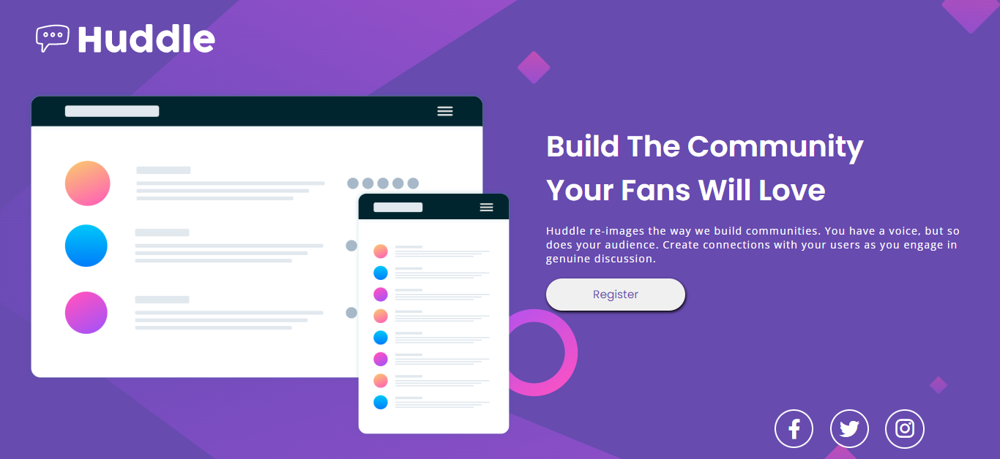
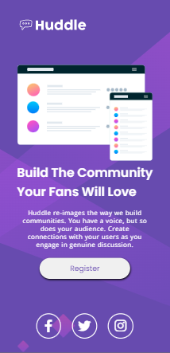

# Frontend Mentor - Huddle landing page with single introductory section solution

This is a solution to the [Huddle landing page with single introductory section challenge on Frontend Mentor](https://www.frontendmentor.io/challenges/huddle-landing-page-with-a-single-introductory-section-B_2Wvxgi0). Frontend Mentor challenges help you improve your coding skills by building realistic projects. 

## 📋 Table of contents

- [Overview](#overview)
  - [The challenge](#the-challenge)
  - [Screenshot](#screenshot)
  - [Links](#links)
- [My process](#my-process)
  - [Built with](#built-with)
  - [What I learned](#what-i-learned)
  - [Continued development](#continued-development)
- [Author](#author)
- [Acknowledgments](#acknowledgments)

## 🗺️ Overview

The challenge is a simple landing page with a logo, background image, image in the content, texts and social media icons. But for me it's a bit complex, because there are a lot of things that I'm evolving, like the flex display and the grid.

### 📝The challenge

Users should be able to:

- Display flex e display grid;
- Responsiveness.

### Screenshot

# 🖥️ Desktop

# 📱 Mobile

### 🔗 Links

- Live Site URL: [Access Website](https://ericrdgs.github.io/Project-Landing-Page-Quest-001/)

## 📊 My process

### 🏗️ Built with

- Semantic HTML5 markup
- CSS custom properties
- Flexbox
- CSS Grid

### 📖What I learned

In this challenge you can understand more about the flex display, the display grid and also the responsiveness.

### 🐱‍💻 Continued development

I want to continue learning about flex display and responsiveness

## 🤓 Author

- Website - [Github](https://github.com/EricRDGS)
- Frontend Mentor - [@EricRDGS](https://www.frontendmentor.io/profile/yourusername)

## 👍 Acknowledgments

My thanks go to the devquest course, without the professors I wouldn't be solving this challenge or learning about programming

